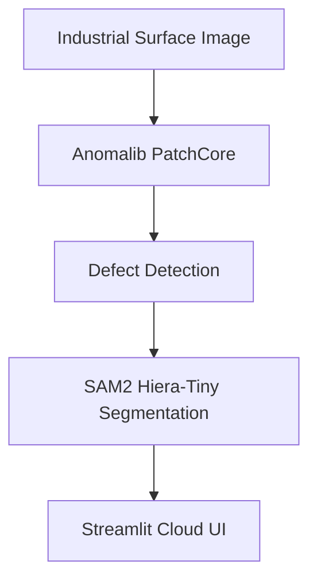
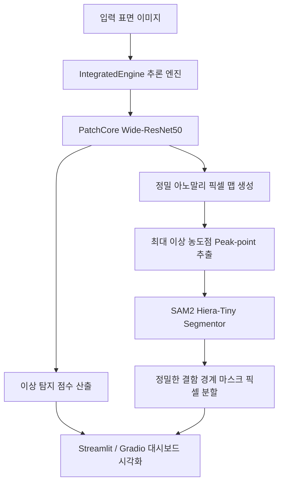

# Surface Anomaly Detection System (표면 이상 탐지 시스템)

[](https://github.com/HyunchanAn/SG_proj_005)
[](https://github.com/HyunchanAn/SG_proj_005)
[](https://github.com/HyunchanAn/SG_proj_005)
[](https://github.com/HyunchanAn/SG_proj_005)
[](https://github.com/HyunchanAn/SG_proj_005)

## Technical Architecture & Workflow

### Architecture Diagram


## 프로젝트 개요
이 프로젝트는 딥러닝(Anomalib PatchCore)을 활용하여 산업 자재 표면의 결함을 탐지하고 분할하는 통합 엔진 솔루션입니다.
Windows(RTX 5080) 및 Apple Silicon(M2 Pro) 가속 환경에 완벽히 대응하며, 소량의 정상 이미지만으로도 고성능 정밀 결함 검출이 가능합니다. 웹 인터페이스(app.py)는 OpenCV 시스템 라이브러리 의존성을 제거하여 Streamlit Cloud 등 이기종 클라우드 서버 환경에서도 완벽히 단독 구동되도록 견고하게 설계되었습니다.

## 시스템 아키텍처 및 처리 흐름 (System Architecture)
본 시스템은 정상 데이터만을 학습하는 PatchCore의 이상 진단 기능과 prompt 유도형 초경량 SAM2 세그멘테이션 백엔드를 결합한 하이브리드 파이프라인을 구축하고 있습니다.



## 빠른 시작 (Quick Start)

### 1. 환경 설정 (Environment Setup)
REQUIREMENTS.md 문서 혹은 pyproject.toml 파일을 참고하여 가상환경 및 필수 라이브러리를 셋업합니다.
```bash
python -m venv venv
source venv/bin/activate  # Windows: .\venv\Scripts\activate
pip install .
```

### 2. 데이터 준비 (Data Preparation)
학습을 위해 정상 표면 이미지 약 50장이 필요합니다.

* 방법 A: 사용자 데이터 사용
  1. `datasets/custom/train/good` 폴더에 학습용 정상 사진을 넣습니다.
  2. `datasets/custom/test/bad` 폴더에 검증용 불량 사진을 넣습니다.
  3. `datasets/custom/test/good` 폴더에 검증용 정상 사진을 넣습니다.

* 방법 B: 샘플 데이터 자동 다운로드 (KolektorSDD)
  ```bash
  python prepare_data.py --download
  ```

* 방법 C: 테스트용 합성 데이터 생성 (추천)
  ```bash
  python synthesize_data.py
  ```

### 3. 학습 (Training)
학습 스크립트를 기동합니다. 로컬 하드웨어 사양에 맞는 장치 가속(CUDA/MPS)이 자동 할당됩니다.
```bash
python train.py
```
학습 결과 체크포인트(.ckpt) 파일은 `results/` 폴더 내에 생성됩니다.

### 4. 모델 내보내기 (Export)
프로덕션 추론에 사용하기 위해 모델 가중치를 가속 직렬화 포맷(.pt)으로 변환합니다.
```bash
python export.py
```
`exported_models/model.pt` 가중치가 정상 확보됩니다.

### 5. 웹 대시보드 구동 (Web UI)
Streamlit 또는 Gradio 웹 인터페이스를 통해 직관적으로 분석하고 시각화할 수 있습니다.
```bash
# Streamlit 기반 통합 모니터링 대시보드
streamlit run app.py

# Gradio 기반 인터렉티브 정밀 분석 도구
python app_gradio.py
```

## 성능 및 검증 지표 (Performance & Metrics)
Wide-ResNet50 모델 구조와 SAM2 Hiera-Tiny의 연계를 통해 검출 정밀도와 속도를 동시에 최적화하였습니다.

### Metric Summary
| Metric | Score | Framework |
| :--- | :--- | :--- |
| Image AUROC | 1.0000 | Anomalib 2.2.0 |
| Image F1-Score | 1.0000 | Anomalib 2.2.0 |
| Inference Latency | ~21ms | CUDA Optimized |

## 개발 및 검증 장비 사양 (System Environment)
* CPU: AMD Ryzen 9 9900X (12-Core, 4.4GHz~5.6GHz)
* GPU: NVIDIA GeForce RTX 5080 (16GB GDDR7)
* RAM: 64GB DDR5-5600 Dual Channel
* OS: Windows / MacOS 하이브리드 최적화 완료

## 제약 사항 및 예외 대책 (Limitations & Guidelines)
* 가속 하드웨어 권장: 본 모델 학습 파이프라인(PatchCore Wide-ResNet50)은 정상적인 속도 확보를 위해 CUDA 또는 MPS 가속이 탑재된 장비에서 트레이닝할 것을 적극 권장합니다. CPU만 이용할 경우 학습에 수 시간이 소요될 수 있습니다.
* 데이터 균일성: 입력 표면의 조명이나 촬영 각도(수직 90도 탑다운 필수)가 일관되지 않으면 오탐지율이 증가할 수 있습니다. 촬영 가이드를 명확히 숙지하시기 바랍니다.
* SAM2 모듈 누락 대책: SAM2 라이브러리가 로컬에 설치되어 있지 않거나 가중치 로딩에 오류가 발생하면, 시스템은 예외 처리 흐름을 통해 SAM2 기능을 자동으로 비활성화하고 오직 PatchCore 아노말리 맵 분석 결과만을 단독 렌더링하여 중단 없는 서비스를 지원합니다.

## 촬영 가이드 (Photography Guideline)
1. 조명 (Lighting): 균일한 조명을 구성하여 표면에 무의미한 그림자나 고반사 하이라이트가 번지지 않도록 조절하십시오.
2. 구도 (Viewpoint): 렌즈와 표면이 수직이 되도록 탑다운으로 배치하고, 피사체가 카메라 뷰포트에 가득 차도록 구도를 설정하십시오.
3. 배경 (Background): 불필요한 공구나 배경 잡화가 프레임 내에 침입하지 않도록 단색의 차분한 배경 플레이트를 사용하십시오.
