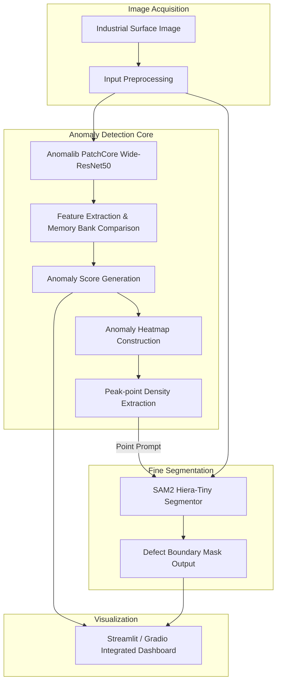

# Surface Anomaly Detection System (표면 이상 탐지 시스템)


## 1. 개요
> [!NOTE] 
> 본 모듈은 메인 통합 오케스트레이터(SG_proj_014) 파이프라인 흐름과는 독립적으로 운영되는 검증 전용 모듈입니다.

딥러닝 모델을 활용하여 산업 자재 표면의 결함을 탐지하고 영역을 분할하는 솔루션입니다. 정상 이미지를 학습하여 결함을 검출하는 비지도 학습 기반 이상 탐지 모델과 세그멘테이션 백엔드를 결합하여 작동합니다.

## 2. 아키텍처 다이어그램


## 3. 기술 스택
- Language: Python 3.12
- Backend/AI Engine: Anomalib (PatchCore), SAM2 Hiera-Tiny, PyTorch
- Frontend/UI: Streamlit, Gradio
- Hardware: AMD Ryzen 9 9900X, NVIDIA GeForce RTX 5080

## 4. 데이터셋 출처
- 사용자 보유 데이터 사용 가능.
- 공개 벤치마크 데이터셋 활용 가능: Kolektor Surface-Defect Dataset (KolektorSDD) 자동 다운로드 스크립트 지원.

## 5. 주요 기능
- 비지도 학습 기반 PatchCore 알고리즘을 이용한 이상 점수 및 아노말리 맵 계산.
- 추출된 이상 탐지 피크 포인트를 활용한 SAM2 기반 마스크 픽셀 분할.
- 모델 학습 파이프라인 및 가중치 포맷 변환(.pt) 기능 제공.
- Streamlit 및 Gradio 기반 시각화 대시보드 지원.

## 6. 설치 및 실행 방법
1. 환경 설정
   ```bash
   python -m venv venv
   .\venv\Scripts\activate
   pip install .
   ```
2. 데이터 준비 및 합성
   ```bash
   python synthesize_data.py
   # 혹은 KolektorSDD 다운로드
   python prepare_data.py --download
   ```
3. 모델 학습 및 내보내기
   ```bash
   python train.py
   python export.py
   ```
4. 웹 대시보드 실행
   ```bash
   streamlit run app.py
   ```

## Docker 실행 방법
`ash
docker run -p 8502:8501 chemahc94/surface-anomaly-detection:latest
`
